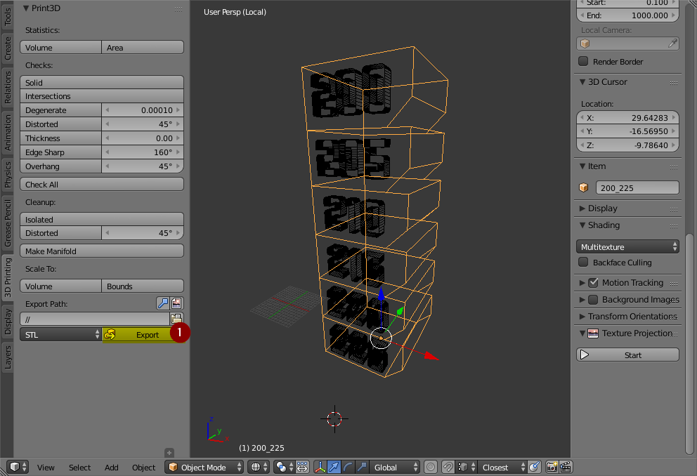

**_WARNING: This file is a work in progress and may contain on or two orthographic errors... or maybee more!_**

Tower Test print for ASA on my [maZEmendel machine](https://github.com/3devangelist/PrusaMendel)

# About

In my experimentation, I see that plastic materials used in FDM have different reactions to temperature, in some temperatures we have more dimensional accuracy and in others, we have more mechanic resistance, in the worst case lose both.
Because of that, I have searched some test solutions [thinigverse](https://www.thingiverse.com/search?q=temp+tower&sa=&dwh=665ab692f115626) and ended up with these models. The true is that, we need a little more to test temperatures, we need a model that we can use and edit to the specific needs. I created this GIT to help you test your own materials.

# Assumptions

**_You should never assume that:_**
* THe same material from different manufactureres has the same properties;
* Changing manufacturer, color or production batch, produces no difference in results; 

**_Some times the materials differers from a production batch to an other, that is not good! But happens, and you should test it!._**

**Keep in mind!** if you want the best mechanical proprieties and better accuracy of your parts or should use the **natural colors** of the materials you chose, normally they are not pretty but the trueth is that pigments are **impurities in your filament**, that worsen the mechanical and printing proprieties.

# Modeling

# Process 

The range of temperatures that you should use, depends on you, I normally start, with the **highest** temperatures to **lowest**, because I want to know what is the lowest possible extrusion temperature can get with the material, and if start with that low temperature the nozzle can get clogged, and then start to print in mid air!
But like Michaël Memeteau, *(big friend of mine)* told me, you can produce sagging, and the file is open-source for you edit according to your needs!.

## 1. Modeling

Like a lot of projects i use blender, because I can, and i love to use it!

You **should** study the model and change it to your needs, the file is [*"TEMP_TEST.blend"*](edit_3D_Blender/TEMP_TEST.blend), this was model in blender 2.79 but you should be able to open it with any higher version with no problem, if you find some problem go [here](https://www.blender.org/download/releases/) and make the download of the right version.
If you never used blender and think it's hard, don't, it's just different. You should use blender, not because is free, but because it's the best, and luckily I am able to provide you the means and some knowledge to learn new ways to do things.

*image Blender1*

I have modeled a solid rectangle with 20X20X10mm *(image blender1(1;2))* and make a array *(image blender1(4))* on Z, in blender these is trivial, but like i wanted to feel the layer adhesion i made a bezel of 4mm *(image blender1(3))*.
In order to later remember the temperature range, i have imprinted the temperatures on the tower a common idea of the community, but to be editable in blender i could not add the *"tower"* and *"text"* because the tower was made with the array modifier and with that modifier i have duplicated some faces, that later on will be the reason to have errors in the boolean union of the meshes. Some times we have to go to work around in blender to do 3D printing, of course you could repair all the meshes in blender but you have to lose the editable information applying all the modifiers stack, and that is not good for later users to edit it.

*image Blender2*

The pipeline for editing the file is simple, you edit the text, selecting the text and enter on edit mode, and then, erase all the number of the temperature range, and type it the range you want, input first the lowest temperature and then going to max temperature **_(if you want >< if you want the reverse <> you should imput the lowest first)_**.

*image Blender3*

If you need more temperature range you have to increase the number of arrays in array modifier and later input more temperatures is simple.
if you want to export the temperature range on the name of the file, you have to add that name in the tower mesh name like in the picture *"Blender4"*

*image Blender4*

### 1.2. Exporting

To be able to export the model to STL, you have to select the to meshes and is important to select first the text then the tower, then use the add-on *"mesh:3D print tool box"* **_([how to](https://wiki.blender.org/index.php/Extensions:2.6/Py/Scripts/Modeling/PrintToolbox))_**, and then like in the image *"Blender5"* click on export, if you do not add any name on exportation it will export with the name of the last selected mesh, on the folder that your blender file is!.

*image Blender5*

## 2. Slicing

