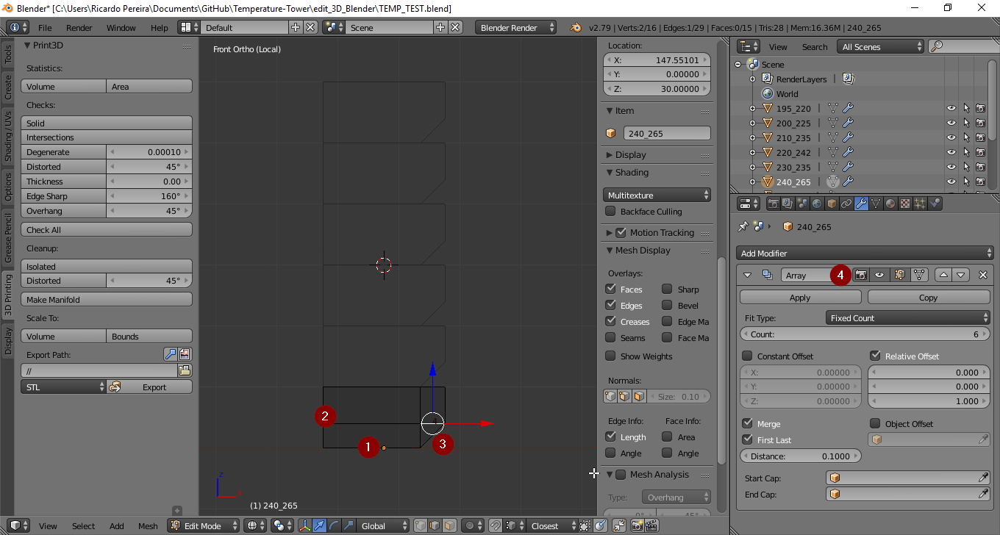
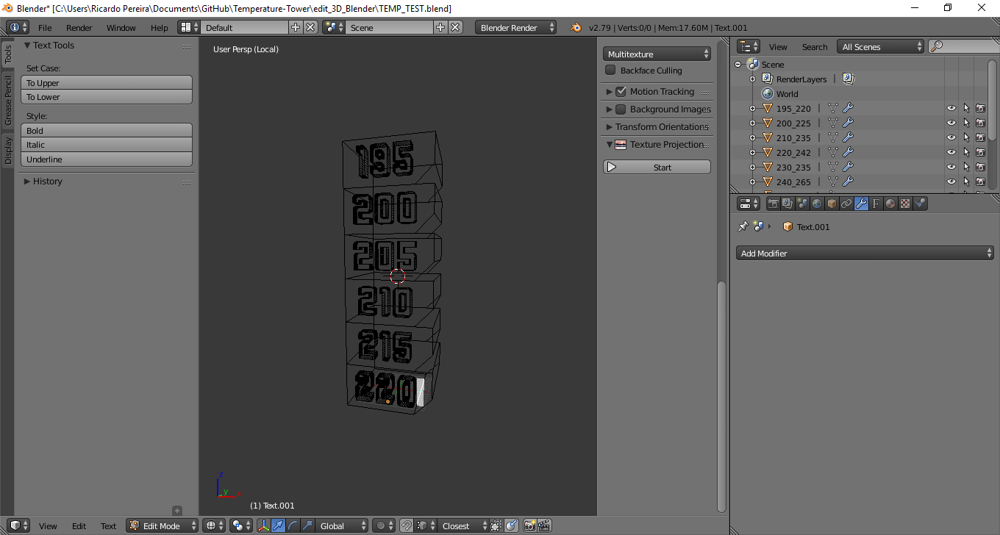
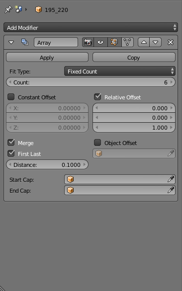
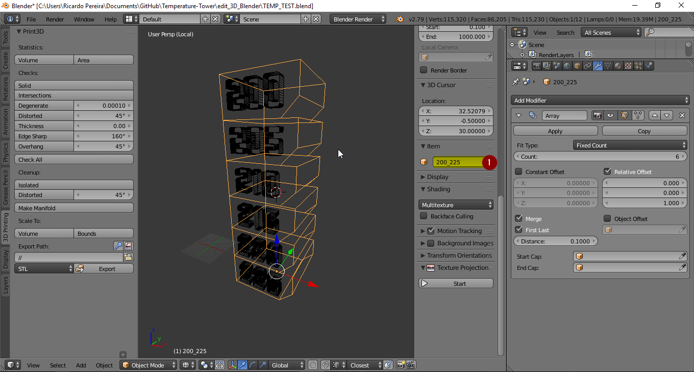

# About

In my experimentation, i see that the plastic material in FDM as different reactions to the temperature, in some temperatures we have more dimensional accuracy in some we have more mechanic resistance, in some we lose both.
Because of that, i have research in [thinigverse](https://www.thingiverse.com/search?q=temp+tower&sa=&dwh=665ab692f115626) and i came with these models, but the true is that, we need a little more to test temperatures, we need a model that we can use and edit to the specific needs, and I created these GIT for others can test their materials.

# Assumptions

You should never assume that if is the same material as the same properties, if you change the manufacturer our change the color, some times the materials differers of the production batch, that is not good! but happens, and you should test it!.

**Keep in mind!** if you want the best mechanical proprieties and better accuracy of your parts or should use the **natural colors** of the materials you chose, normally they are not pretty but the true is that pigments are like **waste in your filament**, only worsen the mechanical and printing proprieties   

# Modeling

Like a lot of projects i use blender, because i can, and i love to use it!
You can, and should study the model and change it to your needs, the file is [*"TEMP_TEST.blend"*](edit_3D_Blender/TEMP_TEST.blend), these was model in blender 2.79 but you should open with any hight version with no problem, if you find some problem go [here](https://www.blender.org/download/releases/) and make the download of the right version.
If you never used blender and you think is hard, is not hard, is different, and very good. You should use blender, not because is free, but because is very good, and luckily i am able to provide you the means and some knowledge to learn new ways to do things.

## Process 

*image Blender1*

I have modeled a solid rectangle with 20X20X10mm *(image blender1(1;2))* and make a array *(image blender1(4))* on Z, in blender these is trivial, but like i wanted to feel the layer adhesion i made a bezel of 4mm *(image blender1(3))*.
In order to later remember the temperature gantry, i have imprinted the temperatures on the tower a common idea of the community, but to be editable in blender i could not add the *"tower"* and *"text"* because the tower was made with the array modifier and with that modifier i have duplicated some faces, that later on will be the reason to have errors in the boolean union of the meshes. Some times we have to go to work around in blender to 3D printing, of course you could repair all the meshes in blender but you have to lose the editable information applying all the modifiers stack, and that is not good for later users edit it.

*image Blender2*

The pipeline for editing the file is simple, you edit the text, selecting the text and enter on edit mode, and then, erase all the number of the temperature range, and type it the range you want, input first the lowest temperature and then going to max temperature.

*image Blender3*

If you need more temperature range you have to increase the number of arrays in array modifier and later input more temperatures is simple.
if you want to export the temperature range on the name of the file, you have to add that name in the tower mesh name like in the picture *"Blender4"*.

## Exporting

For you be able to export the model to STL you have to select the to meshes and is important to select first the text then the tower, then using the and-on *"mesh:3D print tool box"*
